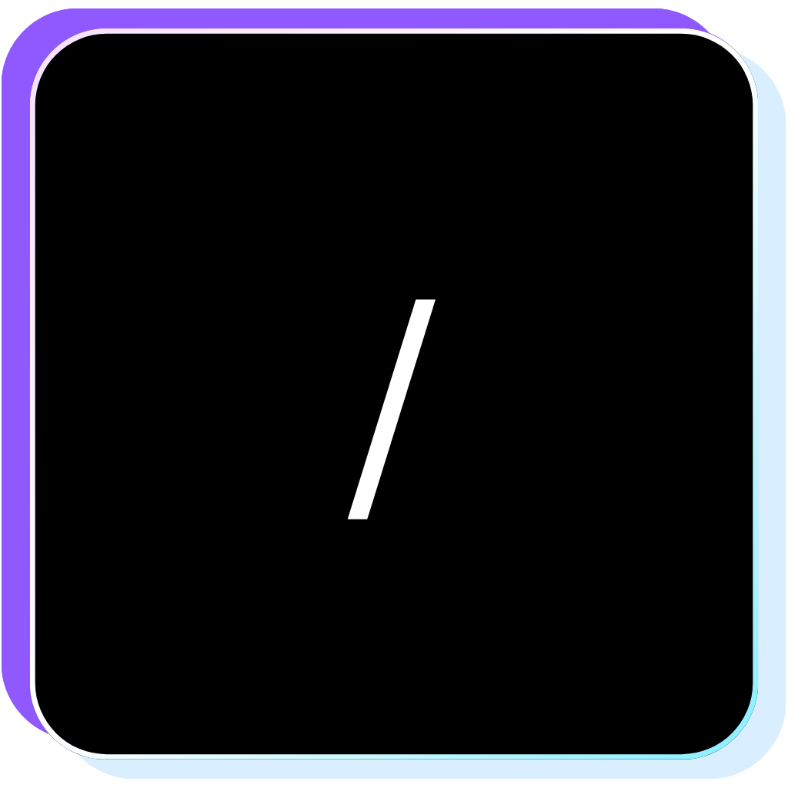
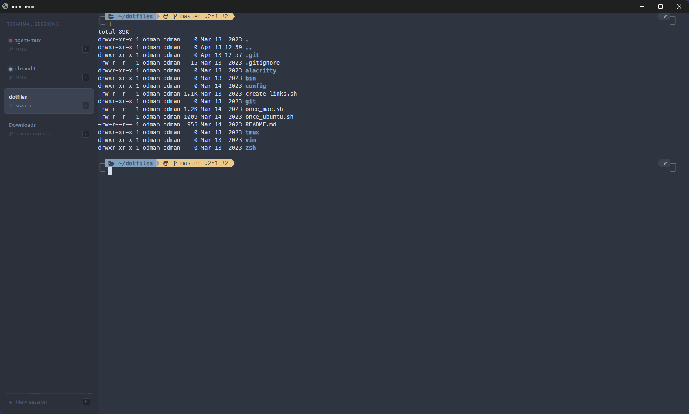

<p align="center">
  
</p>

# Agent Mux

A terminal multiplexer for managing multiple AI agent sessions. Provides a sidebar with session tabs and a full terminal pane powered by xterm.js. Purpose-built for running concurrent Claude Code sessions across different projects. Runs as a standalone Electron desktop app or in the browser.



## Prerequisites

- Node.js 22+ (managed via [mise](https://mise.jdx.dev/))
- pnpm

## Setup

```bash
mise install
pnpm install
```

## Running

```bash
pnpm dev
```

Opens a standalone Electron desktop window.

### Browser Mode

```bash
pnpm dev:browser
```

Starts the server and Vite dev server separately. Opens at http://localhost:3000 with hot module replacement.

### Building the Executable

```bash
pnpm dist
```

Produces a portable executable in `electron/release/`:

- **Windows**: `win-unpacked/agent-mux.exe`
- **macOS**: `mac-unpacked/agent-mux.app`
- **Linux**: `linux-unpacked/agent-mux`

The build skips native module recompilation (`npmRebuild: false`) because node-pty's prebuilds for Node 22 are ABI-compatible with Electron 41's embedded Node 22. If you upgrade Electron to a version that ships a different Node ABI, you'll need Python installed for `node-gyp` to recompile node-pty. Install it via `mise use python@3` and remove `npmRebuild: false` from `electron/package.json`.

## Configuration

Optional `config.json` (gitignored):

```json
{
  "shell": "/bin/zsh",
  "serverPort": 3000,
  "clientPort": 5173,
  "initialCommand": "claude",
  "auxInitialCommand": ""
}
```

- `shell` -- path to shell binary. Defaults to `$SHELL` or `/bin/sh`.
- `serverPort` -- server port. Defaults to `3000`.
- `clientPort` -- Vite dev server port (browser mode only). Defaults to `5173`.
- `initialCommand` -- command to run when a primary shell starts. Optional.
- `auxInitialCommand` -- command to run when an auxiliary shell starts. Optional.

### Config file location

- **Development** (`pnpm dev` / `pnpm dev:browser`): `config.json` in the repo root.
- **Packaged exe**: `config.json` in the Electron user data directory:
  - **Windows**: `%APPDATA%\agent-mux-electron\config.json`
  - **macOS**: `~/Library/Application Support/agent-mux-electron/config.json`
  - **Linux**: `~/.config/agent-mux-electron/config.json`

If the file doesn't exist, defaults are used.

## Keyboard Shortcuts

| Shortcut                 | Action                  |
| ------------------------ | ----------------------- |
| `Ctrl/Cmd + Shift + N`   | New session             |
| `Ctrl/Cmd + Shift + 1-9` | Switch to tab by number |

Shortcut hints are shown as keycap badges on each tab (1-9) and the "New session" button.

## Notification Dots

Session tabs show colored dots reflecting Claude Code state:

- **Green dot** -- Claude Code is actively working, processing a prompt (background tabs only)
- **Blue dot** -- Claude Code is idle, waiting for user input (background tabs only)
- **Red pulsing dot** -- Claude Code needs permission to proceed (all tabs)

Green and blue dots clear when you switch to the tab. Red dots clear only when Claude resumes output after permission is granted.

### Hook Setup

Notification dots require hooks in `~/.claude/settings.json`. On first launch, agent-mux detects missing hooks and offers to install them automatically via a banner at the top of the page. A backup (`settings.json.bak`) is created before any changes. Without these hooks, the tabs will still work but no notification dots will appear.

## Project Structure

```
agent-mux/
├── server/                        # Express + WebSocket backend
│   └── src/
│       ├── server.ts              # Embeddable startServer() entry point
│       ├── index.ts               # Standalone CLI wrapper
│       ├── config.ts              # Optional config.json loader
│       ├── sessions.ts            # Session state (PTY, scrollback, git branch)
│       ├── routes.ts              # REST API endpoints
│       ├── pty-manager.ts         # node-pty wrapper
│       ├── hooks-setup.ts         # Hook detection and auto-installation
│       └── notification-watcher.ts # Polls /tmp for hook state files
├── electron/                      # Electron desktop app wrapper
│   └── src/
│       └── main.ts                # Main process (window, server lifecycle)
├── client/                        # React + Tailwind + xterm.js frontend
│   └── src/
│       ├── App.tsx                # Root component, session + notification state
│       ├── types.ts               # Session, NotificationState types
│       ├── terminal-config.ts     # xterm theme + UI colors
│       ├── hooks/
│       │   └── useSession.ts      # WebSocket + xterm lifecycle per tab
│       └── components/
│           ├── Sidebar.tsx        # Tab list + new session button
│           ├── TabItem.tsx        # Single tab with notification dot
│           ├── TerminalPane.tsx   # xterm.js wrapper
│           ├── DirectoryPicker.tsx # Modal with path autocomplete
│           └── HooksBanner.tsx    # Hook setup warning banner
```
